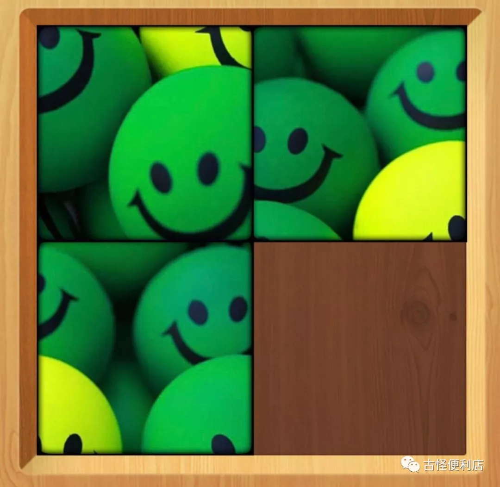
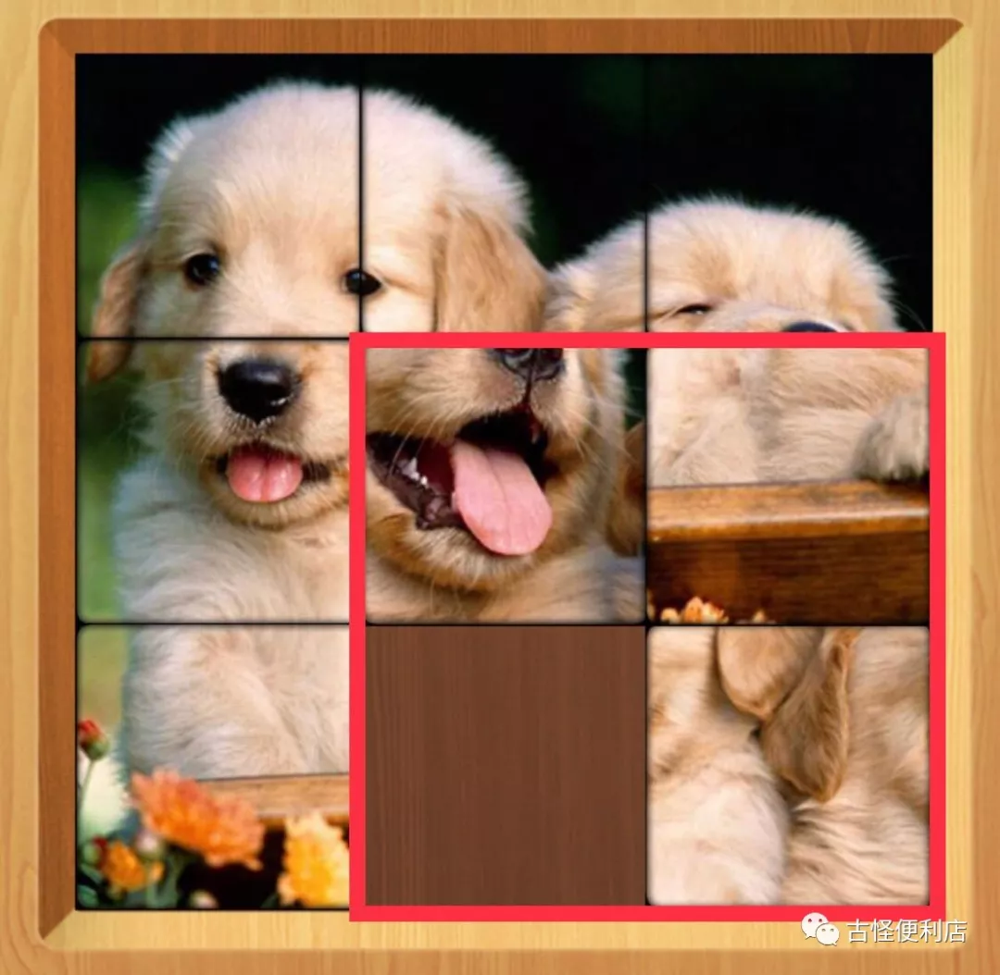
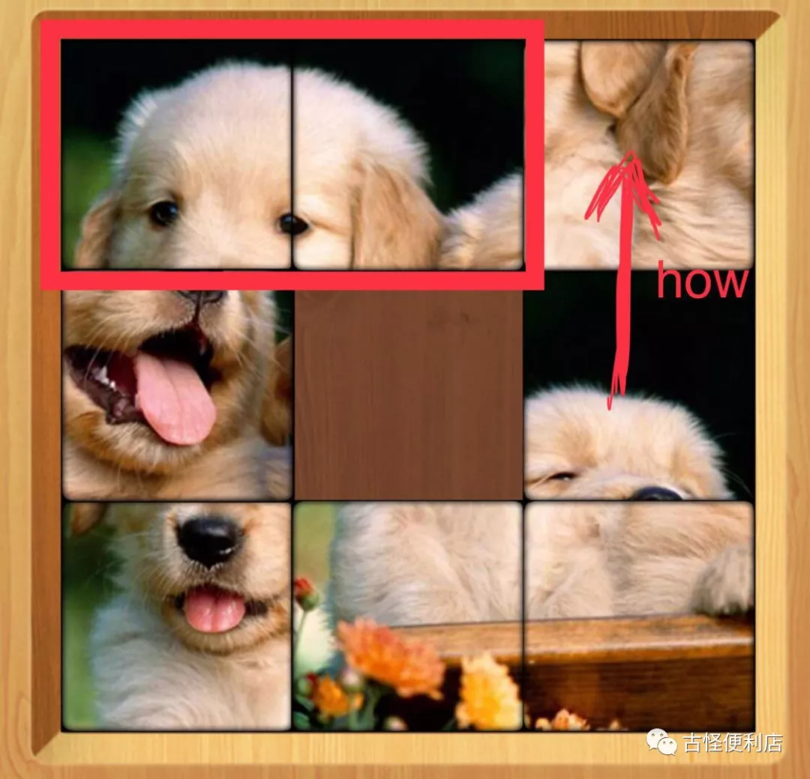
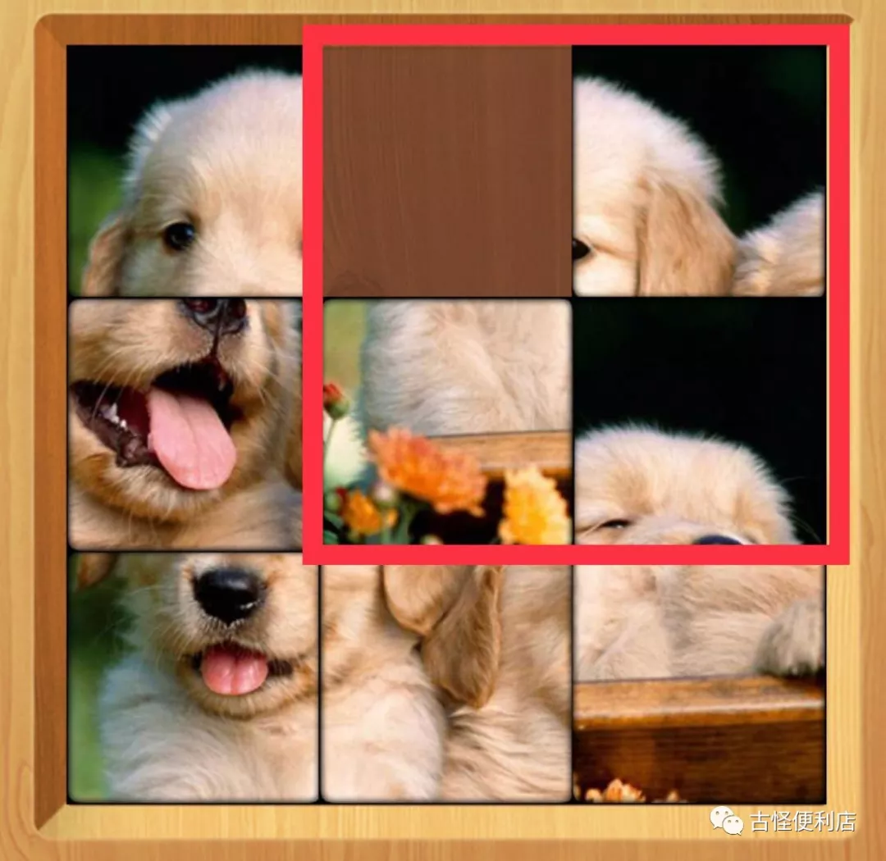
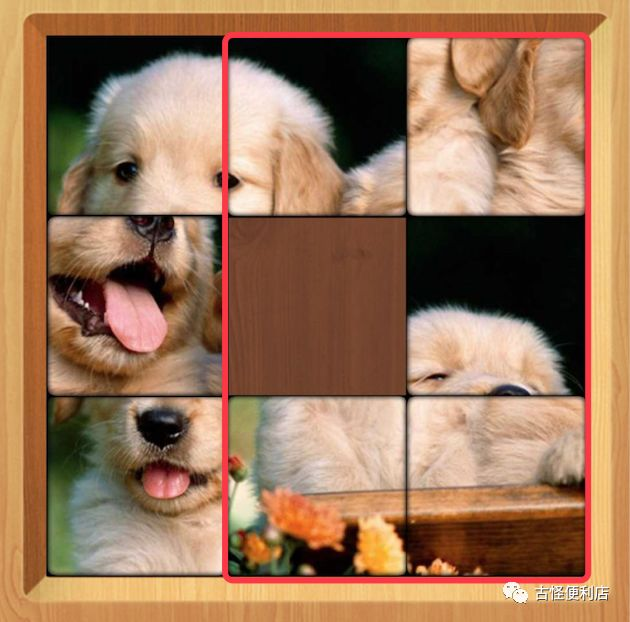
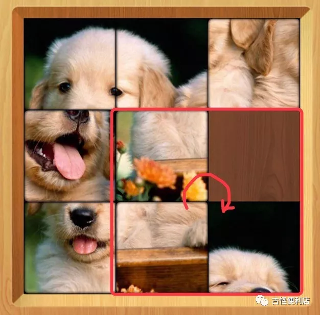
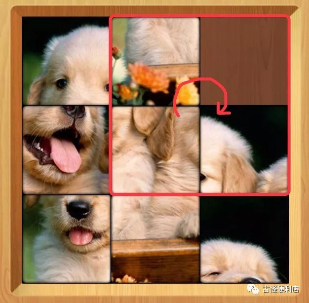
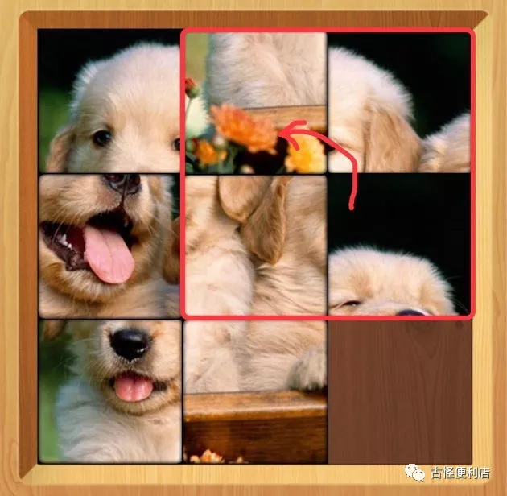
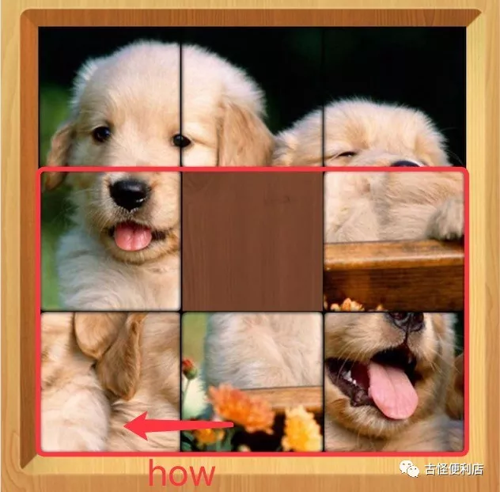
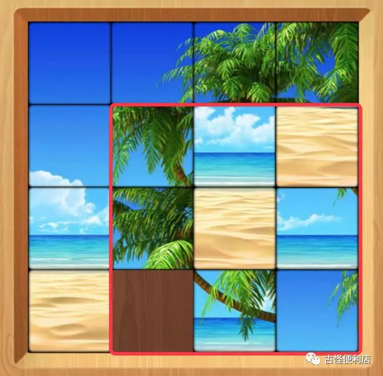

前些天在 cube escape *（一款强烈推荐的解密游戏）* 里面过了一个拼图的小谜题（虽然带了一定的运气成分）。拼完想到这类游戏一定是有某种技巧的，于是专门下了一个拼图的游戏……对照着知乎上的一些回答，终于知道这玩意怎么玩了！

要知道怎么还原这个拼图，我们先要从 2 * 2 的拼图说起。

<!--more-->

## 2×2 拼图

**然而其实 2*2 的拼图根本不用解，因为你是不能替换任何方块的**。道理虽然简单，但这就是解拼图方法的关键。

## 3×3 拼图

然后我们说 3 * 3 的拼图。明白上面这个道理之后，其实我们只需要保证左上角一圈的方块是正确的，那么留下的 2 * 2 区域就一定是正确的了。

那么如何让外围的方块正确？首先来说，第 1、2 个只要通过移动是一定能放到正确的地方的。

然后就是解决这个问题的关键点：**如何把图中第 6 个方块移到第 3 个位置**。*（方便说明，假设图片从左到右从上到下依次为 123456789）*

这个时候你一定非常想直接调换这两个方块的位置，但是我们需要知道：移动拼图无法直接调换图片位置来移动图片，**而是只能通过 2 * 2 区域的旋转达到**。也就是说，你是不能在 2 号不动的情况下把 3 号和 6 号对调位置的，而是只能通过到达下面的状态：

这样只需要图中红色区域内的图片逆时针旋转一周，最上面一排就能够还原出来了。

从初始状态到达这个过程的步骤如下，注意这个过程我们只需要关注右边两列，不涉及到第一列：

1）首先通过旋转让 6 号转到 9 号的位置：

2）让 2 号转到 6 号的位置：

这时这两张图片就挨在一起了

3）两张都往上走，形成了我们说的差一步的状态，然后只要旋转上面的 2*2 就可以了。

完成了第一排之后，我们就剩下还原第一列就行了，实际上，这和还原第一排是 **一模一样** 的（换个角度看）。这时候不用关注已经还原的第一排，只需要关注下两排即可。

至此外围的 5 张图片就都还原了，里面的 2 * 2 旋转几次就 ok。

附一个还原 3 * 3 拼图的视频：[腾讯视频](https://v.qq.com/x/page/u13390q6nh8.html)

## 4×4 拼图

然后我们上升到 4 * 4 的拼图，实际上，这还是一样的道理。我们只要还原最外层的 7 张图片就行，然后还原里面的 3 * 3 即可。

而还原第一排的前三个是没有任何问题的，还原第一排第 4 个，和还原 3 * 3 第一排又是同样的方法。

还原完第一排，然后还原第一列，然后又回到了熟悉的 3 * 3。

so easy！

*注：本文截图来自 ios 游戏 HappyJigsawPuzzle，版权归原著方所有。想试的可以下载玩一下，非广告，哈哈哈*
