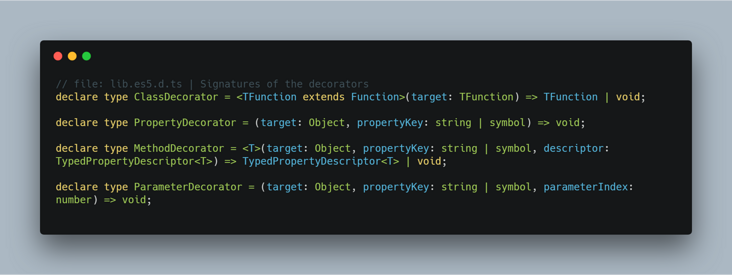

Javascript 中的装饰器（Decorator）是我非常喜欢的一个特性，它可以很好地提高代码的复用性和自解释性。虽然它目前还处在建议征集的第二阶段，但在 TypeScript 里已经做为了一项实验性特性予以支持。

<!--more-->

比如，我们可以用如下方式定义 Controller：

```js
@Controller('/cats')
class CatsController {
  @Get()
  findAll(): string {
    return 'This action returns all cats';
  }

  @Get('/:id')
  findOne(): string {
    return 'This action returns a specified cat';
  }
}
```

如果熟悉 Spring Boot，会觉得这样的定义非常亲切。我们使用了 `@Controller` 和 `@Get` 装饰器，表示调用 `/cats` 返回所有的猫，调用 `/cats/:id` 返回按 `id` 查找的猫。这样的定义形式让代码看上去可读性很强，也清爽多了。

实际上这种写法在 TypeScript 中是比较常见的，比如 [NestJs](https://docs.nestjs.com/controllers) 框架就提供这种方式。

本文简单介绍如何使用装饰器和反射实现这种功能。

## 装饰器概述

在此之前，我们先回顾一下装饰器的用法。装饰器可以被附加到 [类声明](https://www.tslang.cn/docs/handbook/decorators.html#class-decorators)（Class），[属性](https://www.tslang.cn/docs/handbook/decorators.html#property-decorators)（Property）， [访问符](https://www.tslang.cn/docs/handbook/decorators.html#accessor-decorators)（Accessor），[方法](https://www.tslang.cn/docs/handbook/decorators.html#method-decorators)（Method）或 [参数](https://www.tslang.cn/docs/handbook/decorators.html#parameter-decorators)(Parameter) 上，对应的签名如下（其中访问符和属性装饰器签名相同）：



它们分别可以标注到对应的位置：

```js
@classDecorator // 类装饰器
class Hero {
    @propertyDecorator // 属性装饰器
    name: string = "";

    @propertyDecorator
    _hp: number = 100;

    @methodDecorator // 方法装饰器
    attack(@paramDecorator enemy: Enermy /* 参数装饰器 */) {

    }

    @propertyDecorator  // 访问符装饰器
    get hp() {
        return this._hp;
    }
}
```

装饰器被调用时，第一个参数一般要么能拿到类的构造函数，要么能拿到类的原型对象，利用这个参数可以对类或者原型对象进行修改。

## 反射

`Reflect` 对象是 ES6 为了操作对象而提供的新 API，这里需要用到的是其中的 `Metadata API`，它是 ES7 的一个提案，主要用来在声明的时候添加和读取元数据。我们主要用到 `defineMetadata` 定义元数据、 `hasMetadata` 判断元数据是否存在 和 `getMetadata` 获取元数据。具体函数签名见 Metadata Proposal。

要使用 Metadata API，我们需要引用 [reflect-metadata](https://github.com/rbuckton/reflect-metadata) 这个库。

## 思路

于是我们现在手上有两样工具，一个是装饰器，当我们使用 `@Controller`、`@Get`、`@Post` 等标注在类或方法上时，我们可以获取到类的构造函数、类的原型对象，根据装饰器传入的参数，能获取到路由的路径和请求方法。

但我们还需使控制器可以运行，这时就可以利用反射，拿到装饰器传入的参数和对应的请求方法，构造出对应的路由。

## 实现

这里以 Express 框架为例，我们实现对应的装饰器，让 Express 可以支持装饰器标注来添加路由，首先新建 `index.ts` 如下：

```js
import * as express from 'express';
import { Request, Response } from 'express';

const app = express();

app.get('/', (req: Request, res: Response) => {
  res.send('Hello World!');
});

app.listen(3000, () => {
  console.log('Started express on port 3000');
});
```

这是一个基础的 Express 入口文件。

### `@Controller` 装饰器

接下来实现 `@Controller` 装饰器，它是标注在控制器 **类** 上的，用来标注这个类是一个控制器类，并提供一个路由前缀作为参数。因为类装饰器第一个参数是类的构造函数，所以我们将该装饰器传入的前缀参数定义到构造函数的元数据中，key 为 `prefix`。


```js
// Controller.ts
export const Controller = (prefix: string = ''): ClassDecorator => {
  return (target: Function) => {
    Reflect.defineMetadata('prefix', prefix, target);
  };
};
```

### `@Get` 装饰器
`@Get`、`@Post` 等作为请求方法的装饰器实现原理都是相似的，这里以 `@Get` 方法举例，这个装饰器应该标识请求的方式和请求的路由，另外保存被标注的函数，因为这个函数将被作为路由函数调用。

我们首先定义一个元数据接口：

```js
// RouteDefinition.ts
export interface RouteDefinition {
  path: string;
  requestMethod: 'get' | 'post' | 'delete' | 'options' | 'put';
  methodName: string;
}
```

`@Get` 装饰器的实现如下：

```js
// Get.ts
import {RouteDefinition} from './RouteDefinition';

export const Get = (path: string): MethodDecorator => {
  return (target, propertyKey: string): void => {
    if (!Reflect.hasMetadata('routes', target.constructor)) {
      Reflect.defineMetadata('routes', [], target.constructor);
    }

    const routes = Reflect.getMetadata('routes', target.constructor) as Array<RouteDefinition>;

    routes.push({
      requestMethod: 'get',
      path,
      methodName: propertyKey
    });
    Reflect.defineMetadata('routes', routes, target.constructor);
  };
};
```

`@Get` 装饰器是标注在方法上的，所以第一个参数是类的原型对象，我们这里还是根据它再获取到类的构造函数，在元数据中添加一个 `routes` 数据，用来保存这个控制器的所有路由。

最后，我们在 Express 的入口文件中，就可以取得所有的控制器，根据反射拿到所有的路由了。

```js
import 'reflect-metadata';

import * as express from 'express';
import { Request, Response } from 'express';
import CatsController from './CatsController';
import { RouteDefinition } from './RouteDefinition';

const app = express();

app.get('/', (req: Request, res: Response) => {
  res.send('Hello there!');
});

app.listen(3000, () => {
  console.log('Started express on port 3000');
});

// 构造路由
[
  CatsController
].forEach(controller => {
  const instance = new controller();
  // 获取 prefix
  const prefix = Reflect.getMetadata('prefix', controller);
  // 获取 routes
  const routes: Array<RouteDefinition> = Reflect.getMetadata('routes', controller);

  routes.forEach(route => {
    // 添加 Express 路由
    app[route.requestMethod](prefix + route.path, (req: express.Request, res: express.Response) => {
      instance[route.methodName](req, res);
    });
  });
});
```

## 参考

- [Routing with TypeScript decorators for node applications](https://nehalist.io/routing-with-typescript-decorators/)
- [Decorate your code with TypeScript decorators](https://codeburst.io/decorate-your-code-with-typescript-decorators-5be4a4ffecb4)
