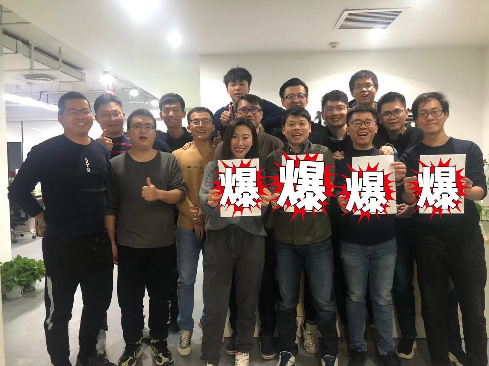
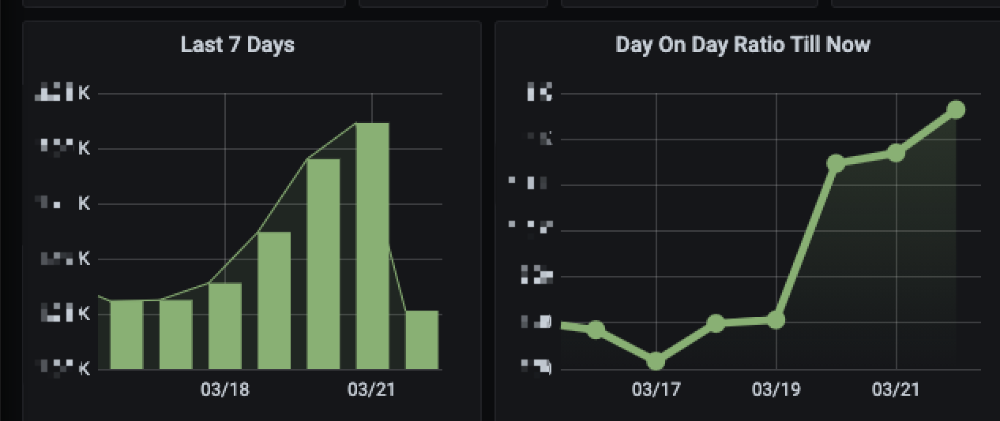

从 2020 年 3 月下旬入职到现在正好过去了一年。回想刚加入公司时，公司才成立半年，刚刚起步。这一年里，我们见证了它从零到一，飞速成长。一年过去，虽然忙忙碌碌，但收获颇丰，在此纪念一下，

<!-- more -->

## 当初的选择

19 年年末的时候，司机哥找到我说有个特别靠谱的事情，那就是做印度教育。为什么特别靠谱呢？因为印度这事儿靠谱，做教育这事儿靠谱，靠谱加靠谱，特别靠谱。

司机哥把我带到一家山东菜馆，酒足饭饱之后开始阐述他对这事情的思考和判断。他从印度的教育现状开始说起，谈到印度的人口、教育现状、教育的需求程度、印度的互联网和线教育的发展现状，最后聊到公司目前在资金和团队方面的优势、预期可达到的状态和财务回报，说得我一愣一愣的，根本停不下来。

在回去的路上，司机哥又从个人的角度与我谈起他的看法。加入一家创业公司，确实需要认真地考虑带给个人的影响——但实际上，这个影响非常小。因为还年轻，我对于创业不需要有太多的担心。即使失败，无非也只是多换个工作，而成功所带来的收益是巨大的。另外，不管成功与否，我都能在创业公司发展过程中收获快速成长，技术和业务上都能在公司发展中找到更多的方向和机会。

于是经过司机哥一顿循(wei)循(bi)善(li)诱(you)，我决定加入这家将来会成为印度第一的教育公司。

## 公司的发展

回顾这一年，公司的发展速度是所有人都没有想到的，从 20 年 11 月份起，每次的售课情况都屡破新高。

*特别说明：为了保护公司数据，在下文需要设未知数 x、y。* 😏

在 11 月份的时候，老板表示这个月我们要招 x 人科，结果招着招着发现这目标有点简单，接着两科合并一科，招 x 人。招着招着发现还是有点简单，于是接连几次调整目标，最后在 11 月底，我们达成了 `2x` 单的里程碑。

紧接着 12 月老板决定乘胜追击，大家咬紧牙关继续 Rush，最后我们以 `12x` 单完美收官。

在最近从 2 月底开始售卖的课程里，数据也是势如破竹，每天都是新高，从单日破 `2x` 到单日破 `4x`，我们的成单量也从 y 位数到了 `y+1` 位数。

总的来说这一年公司的发展十分顺利，我们拼命地提升学生的上课体验，提升老师的教学效果，提升辅导老师的跟课效率，扩大招生，降低成本，取得了不小的成绩。

## 技术成长

公司的发展和个人的成长是相辅相成的，随着业务的发展，每个人能接触到的技术也随之增加。而在创业早期，因为各方面基础设施都不完善，所以能做的事情也就格外地多。

这一年里，我先后做的事情有爬数据、node 服务、学生 PC 端、jenkins 和日常写写页面，这基本符合我对自己工作的预期：有广度、有难度、能体现对业务的价值。

特别是学生 PC 端是以前从来没有接触过的内容，这也是我第一次接触直播相关的业务。这其中涉及到的技术栈很广也很有意思，包括 angular、electron、rxjs、ios 发版和 windows 开发等等，每一项对于我来说都是新鲜的领域。而因为猿辅导技术上的支持有限，大部分只能靠自己摸索，难度比较大也很有挑战性，是能带给我技术成长最多的项目。

## 这一年的感受

从我工作以来，这是我第一次这么近地感受一家公司的成长，究其原因，是我能离公司的数据很近，离决策层很近。老板们每个月会在公司举办一场月会，给大家总结公司一个月以来取得的成果和碰到的问题，并介绍公司对下个月目标的规划。

月会是一个特别好的交流机会，在会议里能听到老板们的思考，知道我们为什么去做、不去做某件事情。在计划里面，数字并不是凭空产生，而是经过考量、讨论、计算得出的。

在此我必须要着重 ~~拍一下马屁~~ 描述一下，我们公司两位老板：Kong 和军哥，都是非常棒的老板。

Kong 非常看重也非常善于思考，每次月会上的分享都让人听得津津有味。他说明观点的时候会举很多例子、随手引出一些公司的案例，也会讲一些小故事，分享看过的书中的观点，从他的话语中可以感受到他的阅读量和在这个过程中的思考，同时非常令人信服。他还会提出自己对市场、对公司目前发展阶段的看法，表达自己的判断，评估目标是否保守或者激进。另外他也能很坦诚地和大家交流意见，会回答诸如“老板是不是在给大家画饼”这样的问题。

军哥非常平易近人，也懂的非常多，几乎任何话题都能和他聊下去，Stephen 老师称他为“杂学家” 😂。因为军哥之前负责产研这块，经常能听到他给我们指出在敏捷实践上的问题，军哥比较喜欢用图表说话，数据表现得好不好一目了然。从去年下旬投放落地页开始和军哥接触比较近，我们一起思考和总结落地页的迭代思路，军哥也经常给我们分享投放的工作内容和他对落地页数据的总结。

总而言之，我认为一家创业公司能走向何方，很大程度上取决于老板的能力。而优秀的人才相互吸引，与优秀的人合作感觉会非常的舒服。在这里大家互相信任、齐心协力，势必要把这件事儿给干成。

最后我们还在继续招人中，用一下 Kong 在看到我的朋友圈招聘文案之后的接龙：

邮箱 [rick.sun@yyinedu.com](mailto:rick.sun@yyinedu.com) 走过路过千万不要错过 😏
