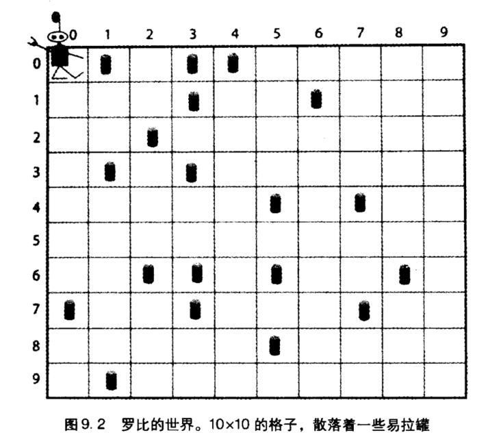
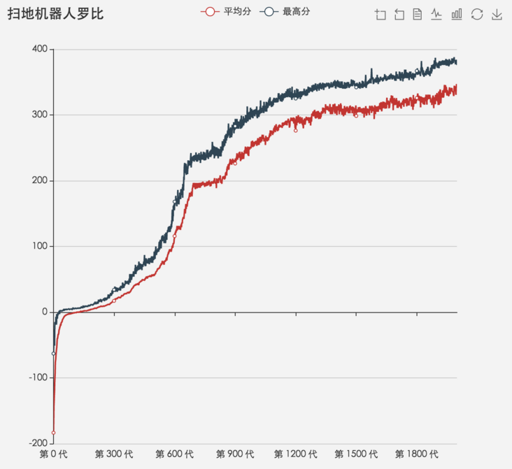

遗传算法是一个很有意思的算法。

我们都知道达尔文提出了伟大的“生物进化论”，他证明了所有的生物都不是上帝创造的，而是在遗传、变异、生存斗争和自然选择中，由简单到复杂，由低等到高等，不断发展变化的。也就是：物竞天择、适者生存、优胜劣汰。

达尔文的进化论给美国的科学家霍兰德留下了深刻的印象，但他从计算机科学的角度思考了这个问题，他想到，是否可以像繁育良种马和良种玉米一样繁育程序。这也就是遗传算法的由来。遗传算法借鉴了进化生物学中的一些现象，包括遗传、突变、自然选择以及杂交等。

<!--more-->

## 扫地机器人罗比

在《复杂》这本书中有个例子，罗比是一个扫地机器人，他生活在一个 10 * 10 格子的世界里，这个世界随机散落着易拉罐，且每个格子最多只有一个易拉罐。罗比的任务是清理这些易拉罐。世界的周围都是墙壁。



罗比的视野是有限的，他只能看到四周格子以及自己所在位置的情况，也就是上下左右和当前位置五个格子的情况。

每次清理工作罗比可以执行 200 个动作，每个动作可以是这七种中的一种：向上走、向下走、向左走、向右走、随机一个方向走、捡罐头、不动。在罗比执行完每一个动作以后都会有一个评分：如果捡罐头时格子中有罐头，那么罐头被捡起，加 10 分。如果捡罐头的时候格子中没有罐头，扣 1 分。如果罗比撞到了墙，扣 5 分。

显然，只要罗比尽可能多捡到罐头、别在没罐头的时候去捡、别撞墙，分数就越高。那么，我们需要设计一套策略，让罗比根据当前所在位置的状态去执行相应的动作，能够拿到最高的分。

现在你可以尝试先设计一下策略，比如：

- 当罗比当前格子有罐头，那么不管周围情况如何，执行捡罐头。
- 当罗比当前格子没罐头，如果周围有罐头，随机选一个有罐头的方向走一步。
- 当罗比当前格子没罐头，如果周围没有罐头，随机选一个方向走一步。

这是一个最简单直接的策略，但也非常随机，几乎算是一种碰运气的算法。

那么，如果我们严格对每一种情况设计相应的策略，一共有多少条策略？

每次罗比看到的格子为：上下左右中，一共 5 个格子，而每个格子有三种可能性：没罐头、有罐头、墙壁。我们把没罐头记为 0，有罐头记为 1，是墙壁记为 2。那么罗比一共能看到的所有情况如下：

```
上 下 左 右 中
0 0 0 0 0
0 0 0 0 1
0 0 0 0 2
0 0 0 1 0
0 0 0 1 1
...
2 2 2 2 2
```

你可能已经发现了，这是一个 3 进制从 00000 到 22222 的数字范围，所以一共有 `3^5 = 243` 种情况。当然有一些情况是明显不可能的，比如罗比所在的格子不可能是墙壁等，但数量级大体不变。

而对于每一种情况，罗比有 7 种动作可以执行：

```
0: 向上走
1: 向下走
2: 向左走
3: 向右走
4: 随机选取方向走
5: 捡罐头
6: 什么都不干
```

所以，243 个状态，每个状态 7 种动作，那么策略的总数是 `7^243` 个。要想遍历所有的策略去求最优解显然是不现实的。在这里可以使用遗传算法，来 “进化” 出一个近似最优解。

## 遗传算法设计

之前已经提到过了，遗传算法借鉴了自然选择中的思想，在遗传算法中，也有“种群”、“染色体”、“基因”、“杂交”、“变异”等概念。

试想我们需要得到的策略是什么样子的。罗比需要根据每一种格子的状态去寻求一种动作，在上面已经提到过，格子的状态分别是 `00000`、`00001`、`00002` 以此类推。我们可以发现，这实际上就是所有的 5 位 3 进制数。

那么，罗比的策略就可以用一个字符串表示，字符串的长度是格子情况的总数，每一位代表对应格子情况所需要作出的策略，比如 `152455021256444063355141362453351200451455123151604162324266004040256060052004316401456203443334225141156451050235106256354245063143011340422626044356444400300555631325215155436144345164455440161256251412661563442063025020602255536510141514365 `。这个策略的第一位是 1，这代表着罗比所处的情况是 `00000` 时，应该作出动作 1，也就是向下走。类似的，第二位是 5，代表罗比在 `00001` 时应该捡罐头。

我们需要通过遗传算法找到最优的策略，这每一个策略实际上就代表着个体，我们通过一个字符串来代表它，这个字符串可以称为染色体（基因组），染色体是基因的集合，种群是染色体的集合。

遗传算法首先需要随机生成一个种群，然后通过“自然选择”来筛选他们，越优秀的个体越容易留下来，并不断繁衍出优秀的子代，这样经过一代又一代的选择，最后留下的个体就是近似最优的。

对应到罗比问题中来，遗传算法过程如下：

1. 初始化种群：随机生成 200 个个体
2. 计算适应度：对 200 个个体进行评分，评分的规则是让罗比打扫 1000 次世界，每次打扫世界都是随机生成的，且每次打扫罗比移动 200 步，最后算出这 1000 次打扫的平均分。
3. 杂交：根据所有个体的得分，随机选取两个个体进行杂交，得分越高的个体越容易被选中。杂交会生成两个子代，将子代放入新种群。重复这个过程，直到新种群的个数达到 200 个。
4. 突变：子代的一个或多个基因会有一定的概率发生突变，发生突变的基因会随机变为其他的动作，比如从 1 变为 6。
5. 迭代：重复以上的过程，直到达到 1000 代。

当然上面的 200、1000 这些数字都是人为设定的，你也可以设定其他的，只要能得到比较好的解就行。

是不是很有意思，因为我们根本不用动脑去设计策略，而是全部交给了计算机。当然这里面还有适应度函数的设计、杂交的设计、参数的选定等令人伤脑筋的事情，但遗传算法的过程说起来就是这样。

### 适应度

在步骤 2 里面，我们对种群中所有个体进行了评分，评分的实现也比较简单，生成一个世界，根据策略在世界内进行 200 个动作，并把这个过程重复 1000 次即可，最后能拿到一个平均分。

### 选取父母

举个栗子，假设种群内只有 3 个个体，他们得分分别是 `1, 2, 7`，我们需要进行两次选择，且得分越高的个体越容易被选中。这里使用 **轮盘赌** 方法来选择个体。

实际上也就是个求概率的问题，三个个体总分为 `1 + 2 + 7 = 10`，那么每个个体占比就可以算出来：`0.1, 0.2, 0.7`。然后让每个个体的概率加上前一个个体的概率，也就是：`0.1, 0.3, 1`。

这样随机生成一个 0 到 1 的数，然后从左往右去比较，小于哪个个体就选择哪个个体即可。

当出现负数怎么办，比如 `-5, 3, 9`，这里可以给每个元素都加上第一个元素的绝对值再加 1，也就是加 6，转为：`1, 9, 15 `，然后再像上面那样按轮盘赌即可。

事实上，这里可以有很多种方法可以选择，比如全部调完正数后让每个元素平方，或者对所有元素加上一个总步数 * 撞墙扣分，代表一次打扫中最多可能扣掉的分。这里选择方法的选取对整个遗传算法影响也是很大的，需要设计一个比较合理的选择方式。

### 杂交

选择出父母之后，需要让父母进行杂交，比如选取某一个位置，取父亲的前半段加上母亲的后半段，以及父亲的后半段加母亲的前半段。

```
203651
100344
取后三位交叉
203344
100651
```

交叉算子的方式还有其他更复杂的。

### 突变

子代有很小的概率会发生基因突变，比如

```
203344 -> 206344
```

第三个位置的基因发生变化。

## 吐槽

实际上这个参数还是很麻烦。。我调了很长时间，最后进化了 2000 次，最高得分大概维持在 380 附近，这是种群平均分和种群中最高分随子代数的趋势图，可以看到种群确实在一点一点进化，如果参数更合理一点相信一定能达到几乎满分的得分的~



贴一个 380 分左右的策略：`450351253450256256354356265152354252154454454351351464051353450055356644335603132054351253256352104350004552116414256156116103346453105056355052053324226604006321154130114255453253352312102112111412414140255154432364654062360530606611264324300`

## 代码

完整代码在 [这里](https://github.com/sunhengzhe/roby)